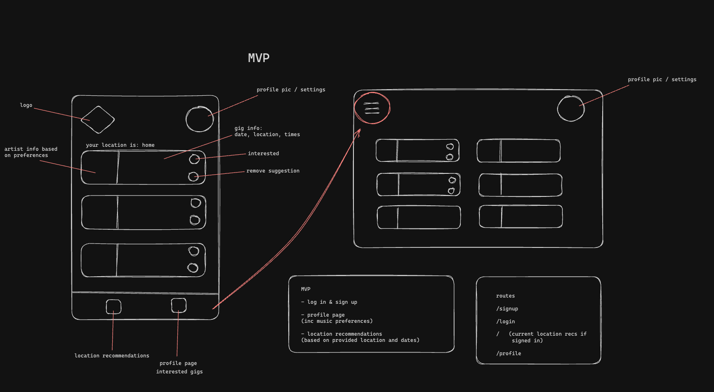
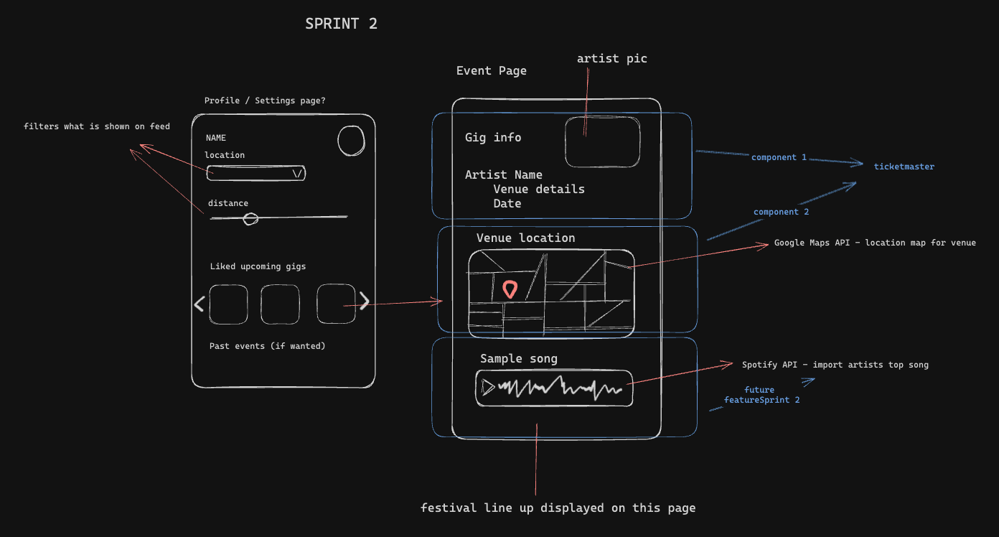

# Gig Guru

## Index

- [App Intro](#app-intro)
- [Team Learning Goals](#team-learning-goals)
- [Design Steps](#design-steps)
- [Reflection](#reflection)
- [Set-Up](#set-up)
- [Testing](#testing)
- [Technologies Used](#technologies-used)
- [Future Developments](#future-developments)
- [Team Info](#team-info)

## App Intro
🎶 Get ready to rock with Gig Guru, your ultimate music discovery app for unforgettable experiences in the UK! Pick your favorite city, and from buzzing festivals to intimate shows, we've got your dream lineup covered. Using Gig Guru, you will never miss a beat! 🎸

Gig Guru is a music event finding app, all you have to do is input a UK city of your choice and you will be able to see upcoming music events in that area. You are able to keep track of events that interest you in your very own account section. and the event page will show you more details including the venue location so you can start planning!

## Team Learning Goals

- Create a music app with React
- Utilise external APIs, including Ticketmaster Discovery API and Google Maps API
- Practiced AGILE Team Development

## Design Steps

As a team we had big plans for what we wanted to include in our app. Using Excalidraw and Trello, we were able to prioritise and agree on the core functionality of our app and what this would look like.

Below are screenshots of our Excalidraw planning. Having this visual plan provided a reference point that we were able to revisit throughout the final project weeks. It also helped us to plan what information we would been needing from external APIs and how we would use it. 





## Reflection 

- We found the time we took to plan as a team really beneficial as it meant we were on the same page with the direction of the project. This continued throughout the 2 weeks as we had regular stand ups and retrospectives as a full team.

- Using 2 external APIs was a fun learning experience for us, although it was a challenge when it came to testing, we all agreed that we have learnt a lot from this.

- Taking time to go through the PRs and merge as a team meant that we were all able to discuss the code and understand each section of our code base. Even if it got more complicated towards the later stages, we worked to resolve merge conflicts as a team

## Set Up

```bash
# Install the dependencies
cd frontend
npm install
cd ../backend
npm install

# Run the bundler
npm run build

# Start the front and backend servers
cd frontend
npm run
cd ../backend
npm run
```

## Testing

we wrote both component and unit tests in addition to e2e testing to mock user interaction with the app.

To run the tests:

```bash
# To run the frontend tests:
cd frontend
npm run cypress:open

# To run the backend tests:
cd backend
jest
```

## Technologies Used

- React JS: used for buidling the individual components of our app
- HTML/CSS: the languages used for building the web app and improving the UI
- Jest: A JS testing framework that we used in the backend
- Cypress: A framework that we used for e2e and front end testing
- Discovery API: the Ticketmaster API which we used for the music events and details in the app
- Google Maps API: Used for the maps on event info pages
- MongoDB Atlas: Database used for storing user information, including encrypted log in info and liked events

## Future Developments

As a team we had a lot of ideas of what we wanted to implement however, due to the 2 week timescale, we had to prioritise core functionality. We did discuss the following features we would like to implement in the future:

- Using the Spotify API. This would allow the user to filter the music event recommendations based on their selected genre preferences. The event info page would also be expanded to include the top Spotify song of the artist, as seen in the Excalidraw planning screenshots.

- We also would like to implement a friends feature. This would make the app like a social media platform based on common music tastes. The idea is that users would be able to add friends and see their interests. They would be notified when a friend of theirs is interested in a similar event. This also opened up discussion of implementing chat functionality between users.

- Finally, we discussed implementing the option to book tickets through the site. We had looked into this but as the Ticketmaster Discovery API returned third party links and displaying this was not possible using this API. We discussed how this would be an interesting challenge to work around.

## Team Info

Your resident Gig Gurus are:

- [Alice Wood](https://github.com/aliceswood)
- [Barney Wilton](https://github.com/bwilton93)
- [Charlie Parker](https://github.com/cshjp)
- [Julian Festing](https://github.com/Raphael40)
- [Ormeline Luyengi](https://github.com/Ormeline)
